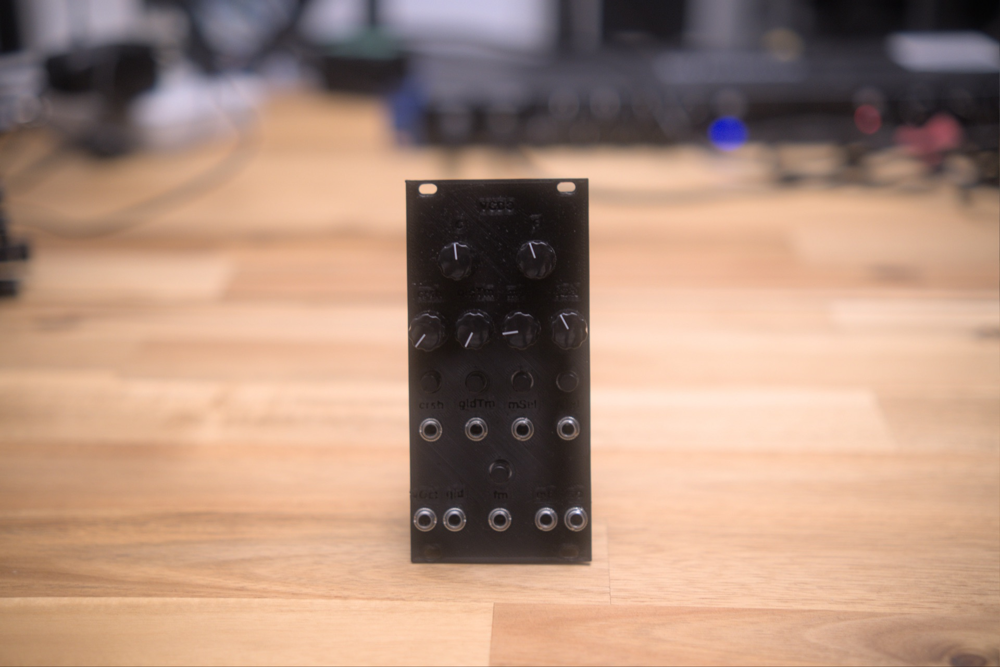

This module is shared under a [Creative Commons Attribution-NonCommercial-ShareAlike 4.0 International license](https://creativecommons.org/licenses/by-nc-sa/4.0/). All credits go to Tom Wiltshire, founder of Electric Druid.

# Eurorack Electric Druid VCDO1

 A Eurorack wavetable oscillator module based on the VCDO1 chip from Electric Druid
# Features added from the original VCDO circuit from Electric Druid
 - CV controllable bitcrush and glide amounts
# Inputs and outputs
## Inputs
 - Note CV (0v to 5v)
 - FM (10vpp)
 - Main wave select (10vpp)
 - Sub wave select (10vpp)
 - Bitcrush amount (10vpp)
 - Glide time amount (10vpp)
 - Glide on/off (0v to 5v)
## Outputs (10vpp)
 - Main oscillator
 - Sub oscillator

## Build status

What's ready for builders today, and what's still on the TODO list:

**Production assets** (what you need to actually fabricate and assemble a final unit)

- [x] Schematic — Rev 0.1.5 ([Electric Druid VCDO1_Multiboard_Schematic_0.1.5.pdf](Schematic%20PDFs/Electric%20Druid%20VCDO1_Multiboard_Schematic_0.1.5.pdf))
- [ ] PCB layout — in progress — multiboard layout in `kicad/`, not yet separated for fab
- [ ] Gerber files for fabrication — none yet
- [x] BOM — [BOMs - VCDO1 - Schematic Rev 0.1.2.pdf](BOMs/BOMs%20-%20VCDO1%20-%20Schematic%20Rev%200.1.2.pdf)
- [ ] Final front panel (SVG/PDF for fab) — none yet
- [x] License — [LICENSE](LICENSE)

**Prototype assets** (for breadboard / perfboard / 3D-printed-panel builds before final PCB)

- [x] 3D-printed prototype panel STL — [VCDO.stl](3D%20printed%20front%20panel/VCDO.stl)

**Documentation**

- [x] Photos of the assembled module — see [photos/](photos/)
- [ ] Demo video — none yet
- [ ] Build / assembly instructions — none yet

Want to help fill a gap (build photos, gerbers, an assembly guide)? Open an issue or PR.
